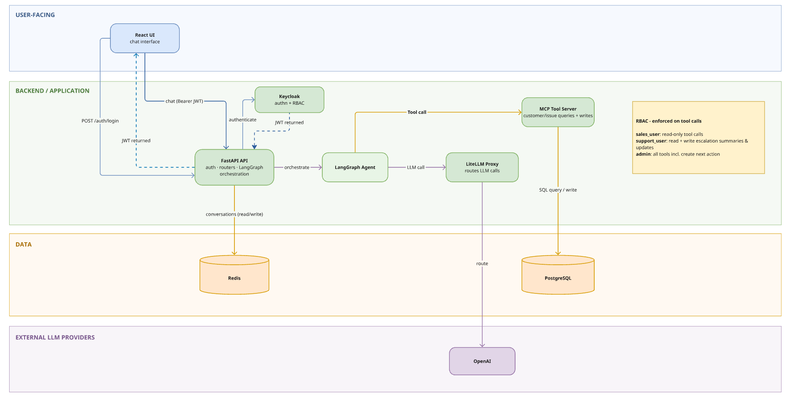
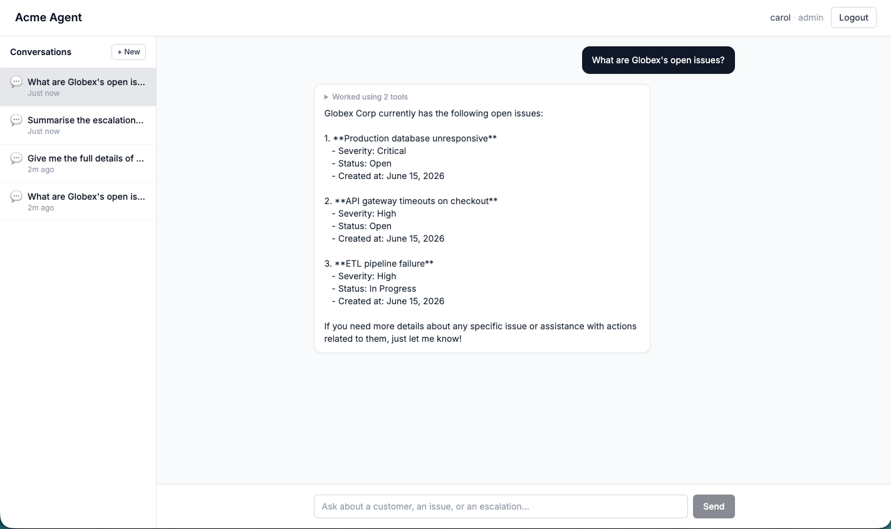

# Agentic Support Assistant

A role-aware enterprise support agent built with LangGraph, FastAPI, and MCP. Agents look up customers and issues, draft escalation summaries, and record next actions — all scoped to the caller's Keycloak role.

## Deliverables

| | |
|---|---|
| **Eval results** | [docs/EVALUATION.md](docs/EVALUATION.md) |
| **AI usage notes** | [docs/AI_USAGE.md](docs/AI_USAGE.md) |

## Architecture



**Folder structure**

```
ui/          React + TypeScript frontend
api/         FastAPI backend — auth, routers, LangGraph agent, Alembic migrations
mcp_server/  MCP tool server — customer/issue queries and writes against Postgres
infra/       Docker configs for Keycloak, LiteLLM, and Postgres
```

**Services (Docker Compose)**

| Service      | Port | Purpose                                      |
|--------------|------|----------------------------------------------|
| `api`        | 8000 | FastAPI app + LangGraph agent                |
| `ui`         | 3000 | React frontend                               |
| `mcp_server` | 8001 | MCP tool server                              |
| `keycloak`   | 8080 | Auth & RBAC (`sales_user`, `support_user`, `admin`) |
| `litellm`    | 4000 | LLM proxy (OpenAI)                           |
| `postgres`   | 5432 | Primary database                             |
| `redis`      | 6379 | Conversation history cache                   |

## Quickstart

**1. Copy env and fill in your API keys**

```bash
cp .env.example .env
# Edit .env — add OPENAI_API_KEY
```

**2. Start all services**

```bash
docker compose up -d
```

This runs migrations and seeds dev data automatically via the `migrate` service.

**3. Open the UI**

Visit `http://localhost:3000` and log in with one of the test users below.

## Try it

**Test users**

| Username | Password    | Role           | Can do                                      |
|----------|-------------|----------------|---------------------------------------------|
| alice    | password123 | `sales_user`   | Read customers and issues                   |
| bob      | password123 | `support_user` | Read + write escalation summaries & updates |
| carol    | password123 | `admin`        | All of the above + create next actions      |



**Sample queries to try**

- `What are Globex's open issues?`
- `Give me the full details of Globex's critical issue`
- `Summarise the escalation risk for Globex`
- `Create a next action for Globex's critical issue: escalate to CTO within 1 hour` _(log in as carol)_

## Agent roles

| Role           | Capabilities                                                   |
|----------------|----------------------------------------------------------------|
| `sales_user`   | Read customers and issues                                      |
| `support_user` | Read + create escalation summaries, add issue updates, record recommendations |
| `admin`        | All of the above + create next actions                         |

## Environment variables

See `.env.example` for all variables. Key ones:

| Variable              | Description                                      |
|-----------------------|--------------------------------------------------|
| `OPENAI_API_KEY`      | Required — used by LiteLLM proxy                |
| `LITELLM_MODEL`       | Model name passed to LiteLLM (default: `gpt-4o-mini`) |
| `LANGSMITH_API_KEY`   | Optional — enables LangSmith tracing             |
| `LANGSMITH_TRACING`   | Set to `true` to enable tracing                  |

## Tests

```bash
python tests/test_api.py
python tests/test_agent.py
python tests/test_auth.py
python tests/test_mcp.py
```

## Eval

Run it in Docker — **no host Python or venv needed** (just `docker compose up` first):

```bash
# fast: trajectory only (~1 min, no judge calls)
docker compose run --rm eval

# full: trajectory + grounding + reasonableness (judge-LLM calls, slower)
docker compose run --rm -e RAGAS_ENABLED=true eval
```

